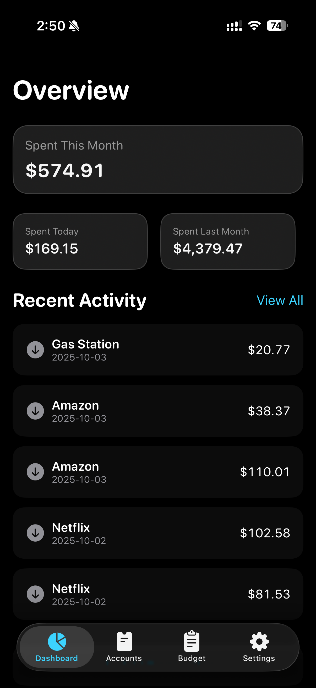
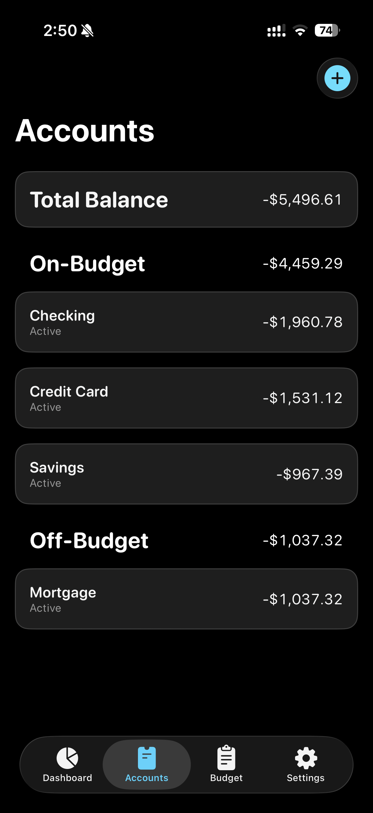
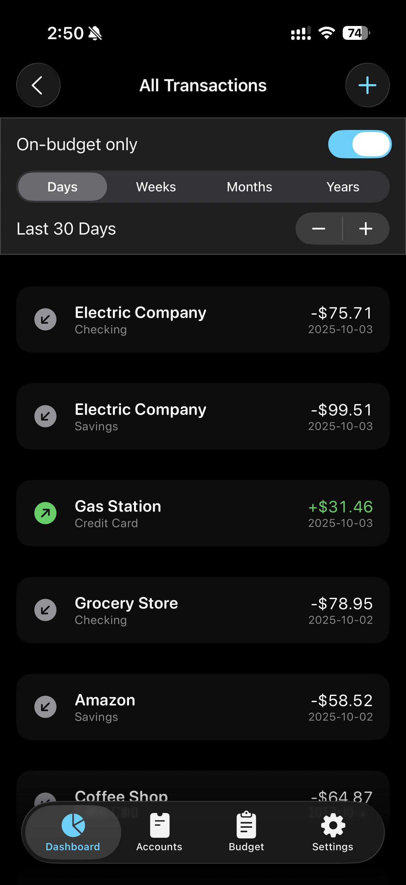
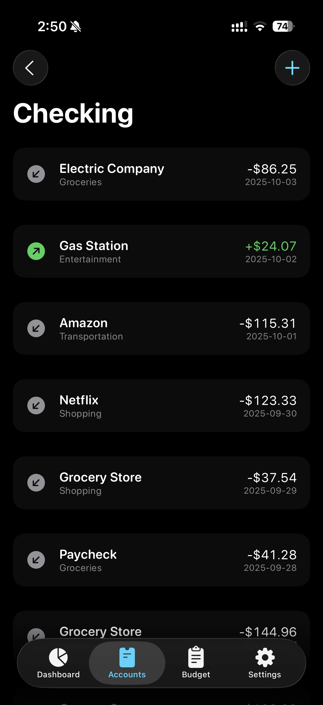
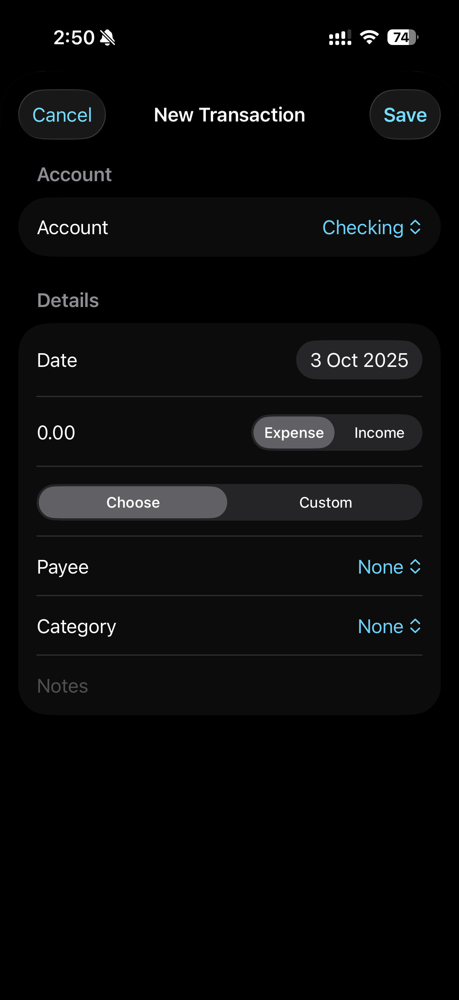
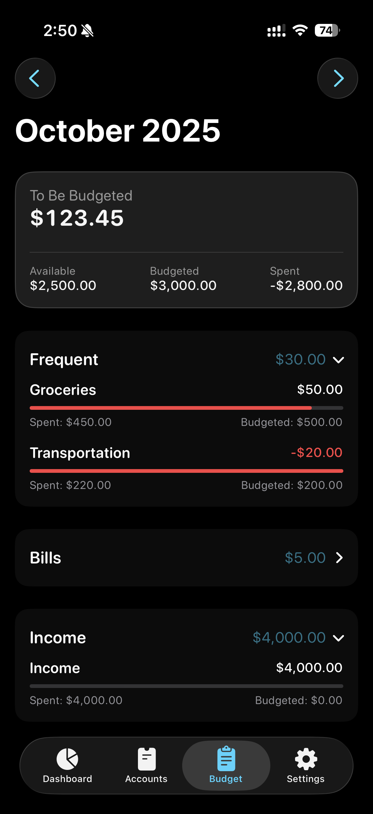

# Actual Accounts iOS App

A modern, native iOS app for managing your personal finances with the Actual Budget backend. Built with SwiftUI and designed for a clean, intuitive user experience.

## Features

### 💰 **Financial Overview**
- **Dashboard**: Quick insights with spending metrics and recent transactions
- **Account Management**: View all your accounts with real-time balances
- **Transaction Tracking**: Comprehensive transaction history with filtering
- **Budget Planning**: Visual budget management with category breakdowns

### 🧪 **Demo Mode**
- **Sample Data**: Test the app with realistic demo data
- **Toggle On/Off**: Switch between demo and real data seamlessly

## Screenshots

<table>
  <tr>
    <td align="center">
      
      
Dashboard

    </td>
    <td align="center">
      
      
Accounts

    </td>
    <td align="center">
      
      
All Transactions

    </td>
  </tr>
  <tr>
    <td align="center">
      
      
Account Transactions

    </td>
    <td align="center">
      
      
New Transaction

    </td>
    <td align="center">
      
      
Budget

    </td>
  </tr>
</table>

## Installation

### Prerequisites
1. Clone this repository
2. Open `iOSApp/ActualAccounts.xcodeproj` in Xcode
3. Ensure you have a valid Apple Developer account for device testing

### Setup
1. **Configure Actual Budget Backend**:
   - Set up your Actual Budget server and [Actual Http API]((https://github.com/jhonderson/actual-http-api) )
   - Note your API endpoint, API key, and sync ID

2. **App Configuration**:
   - Launch the app
   - Go to Settings (via Accounts → gear icon)
   - Enter your Actual Budget credentials:
     - Base URL (e.g., `https://your-actual-http-server.com/v1`)
     - API Key
     - Sync ID
     - Budget Encryption Password (optional)

3. **Alternative - Demo Mode**:
   - Enable "Demo Mode" in Settings
   - The app will show sample data for testing

## API Integration

The app integrates with the Actual Budget API to provide real-time financial data:

- **Authentication**: API key-based authentication
- **Data Sync**: Real-time synchronization with Actual Budget server
- **Offline Support**: Graceful handling of network issues
- **Error Handling**: User-friendly error messages and retry mechanisms

## Development

### Building the App

1. Open a terminal and run `make` in the project root directory. This will build the iOS app and generate an unsigned `.ipa` file.
2. After the build completes, you can find the unsigned IPA at `iOSApp/build/ActualAccounts-unsigned.ipa`.

## Contributing

1. Fork the repository
2. Create a feature branch (`git checkout -b feature/amazing-feature`)
3. Commit your changes (`git commit -m 'Add amazing feature'`)
4. Push to the branch (`git push origin feature/amazing-feature`)
5. Open a Pull Request

## License

This project is licensed under a custom "Personal Use Only" license - see the [LICENSE](LICENSE) file for details.

**Quick Summary:**
- ✅ **Personal Use**: Free to use, modify, and learn from for personal purposes
- ✅ **Open Source**: Full source code available for viewing and study
- ❌ **Commercial Use**: Not allowed for business, corporate, or commercial purposes
- ❌ **Distribution**: Cannot be sold, licensed, or distributed commercially

For commercial licensing inquiries, please contact the author.

## Acknowledgments

- **Actual Budget**: The open-source budgeting backend that powers this app
- **Actual Http API**: The open source http wrapper around the actual budget app, link [here](https://github.com/jhonderson/actual-http-api) 
- **SwiftUI Community**: For inspiration and best practices

## Support

For support, feature requests, or bug reports:
- Open an issue on GitHub
- Check the documentation
- Review the demo mode for feature examples

---

**Built with ❤️ using SwiftUI and Actual Budget**